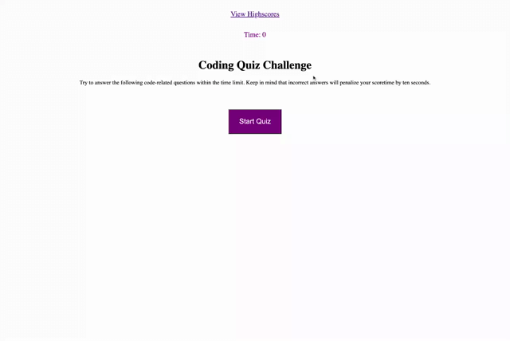

# Quiz

## My Task
Create a timed quiz on JavaScript that stores high scores.

## How does it functions
- When you click start button, then a timer starts and the first question is displayed.
- When you answer a question, you will be presented with the following question.
- If you answer a question incorrectly, then time is substracted from the clock.
- When all questions are answeres or the time reaches 0, the game is over.
- When the game is over, you can save your initials and score.

## Links
https://github.com/NadineMohsen/Code-Quiz

https://nadinemohsen.github.io/Code-Quiz/

## Recording 

